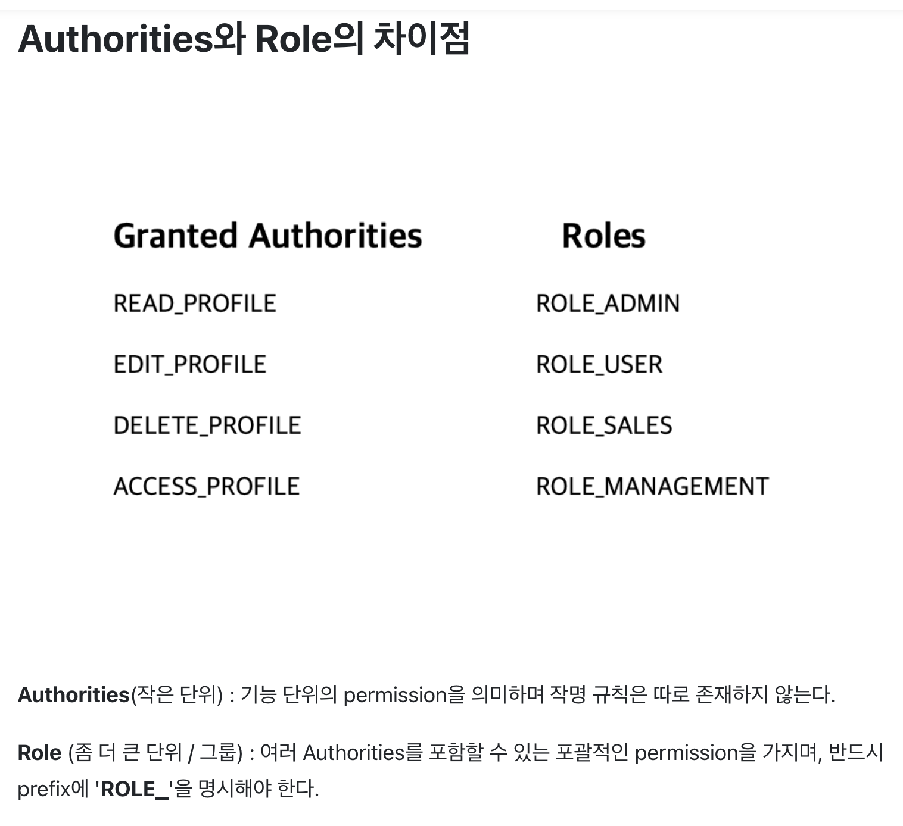

## GrantedAuthority (권한 클래스)

- 사용자에게 부여한 권한은 GrantedAuthority로 추상화
- GrantedAuthority는 Authentication.getAuthorities() 메서드로 접근
- getAuthorities() 메서드 쓰면 GrantedAuthority 객체의 Collection을 리턴

(
principal에 정보를 제공해주는 서비스! UserDetailsService
UserDetails, Spring Security에서 사용자의 정보를 담는 인터페이스이다.
이거의 구현체 만들어서 그걸 UserDetailsService가 principal에 넣어주는 과정을 거치게 된다)

```java
public interface UserDetails extends Serializable {
	//사용자가 가지는 권한에 대한 정보
	Collection<? extends GrantedAuthority> getAuthorities();
	//인증을 마무리하기 위한 패스워드 정보
	String getPassword();
	//인증에 필요한 아이디와 같은 정보
	String getUsername();
	//계정 만료 여부
	boolean isAccountNonExpired();
	//계정 잠김 여부
	boolean isAccountNonLocked();

	boolean isCredentialsNonExpired();

	boolean isEnabled();
}
```

- GrantedAuthority는 인증한 주체(principal)에 부여한 권한에
- 이름/비밀번호 기반 인증을 사용하면 보통 UserDetailsService가 GrantedAuthority를 로드한다
  (GrantedAuthority 정보 또한 UserDetailsService가 제공한다는 말임)

[ UserDetailsService ]
UserDetailsService 인터페이스는 UserDetails 객체를 반환하는 단 하나의 메소드를 가지고 있는데,  
일반적으로 이를 구현한 클래스의 내부에 UserRepository를 주입받아 DB와 연결하여 처리한다.  
UserDetails 인터페이스는 아래와 같다.

```java
public interface UserDetailsService {

    UserDetails loadUserByUsername(String var1) throws UsernameNotFoundException;
}
```

```java
public class UserDetailsCustom implements UserDetailsService{

  @Override
  public UserDetails loadUserByUsername(String username) {

        Member member = memberRepository.findByUsername(username, "test")
                .orElseThrow(() -> new Exception());

        return UserDetailsCustom.builder()
                .id(member.getId())
                .email(member.getEmail())
                .platForm(member.getPlatForm())
                .authorities(Collections.singletonList(new SimpleGrantedAuthority(member.getRole().getKey())))
                .password(member.getPassword())
                .useYn(member.getUseYn())
                .build();
  }
}
```

PreAuthenticatiedAuthenticationProvider,
PreAuthenticatiedGrantedAuthoritiesUserDetailsService,

GrantedAuthority를 "role"이라고 말했는데, 특정 개인이 아닌 넓은 범위에 적용하라는 것이다.  
즉, 예를 들어 이용자가 천명쯤 있을 때 그 중 하나, 31번 이용자를 위해 특별한 GrantedAuthority를 만들지 말라는 것이다.  
GrantedAuthority가 수없이 많아지면 메모리 소모는 물론 최악의 경우 "Authentication" 과정 자체가 느려질 수가 있다.


