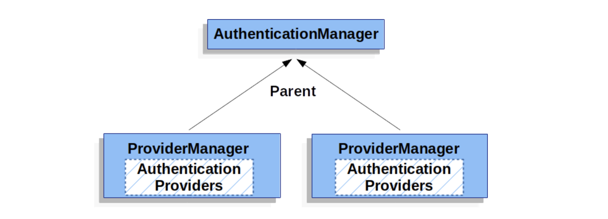

## ProviderManager다

- ProviderManager는 가장 많이 쓰는 AuthenticationManager 구현체이다
- ProviderManager 는 동작을 AuthenticationProvider List에 위임한다
- AuthenticationProvider는 인증 성공, 실패, 결정 내릴 수 없음을 결정한다
- Authentication 전부 인증 못한다? 결정 내릴 수 없다? ProviderNotFoundException과 함께 실패!
- 이 예외는 AuthenticationException의 하위클래스로 넘겨진 Authentication 유형을 지원하는 ProviderManager가 없단 말임

- AuthenticationManager 빈 하나만 외부로 노출하면서도 여러 인증 유형을 지원할 수 있다
- AuthenticationProvider 하나로 이름/비밀번호 검증할 수 있고, 또 SAML 인증 담당할 수 있게 해줄 수 있다. 인증 유형마다 담당 AuthenticationProvider가 있다

- 인증 수행할 수 없는 AuthenticationProvider가 없을 때,
  부모 AuthenticationManager 를 설정할 수도 있다.
- 부모는 AuthenticationManager의 어떤 구현체도 될 수 있지만 보통 ProviderManager 인스턴스를 많이 사용한다

- 여러 ProviderManager 인스턴스에 동일한 부모 AuthenticationManager를 공유하는 것도 가능하다
- 각각 인증 메커니즘이 다른(ProviderManager 인스턴스가 다른) SecurityFilterChain 여러 개가 공통 인증을 사용하는 경우 (부모 AuthenticationManager를 공유) 흔히 쓰는 패턴이다

- ProviderManager는 인증에 성공하면 반환받은 Authentication 객체에 있는 모든 민감한 credential 정보를 지운다. 비밀번호와 같은 정보를 HttpSession에 필요 이상으로 길게 유지하지 않는 것

- 하지만 상태가 없는 어플리케이션에서 성능 향상 등을 위해 사용자 객체를 캐시한다면 문제가 될 수 있다
  Authentication이 캐시 안에 있는 객체를 참조하고 있는데(UserDetails 인스턴스 등) credential을 제거한다면,캐시된 값으로는 더 이상 인증할 수 없다. 캐시를 쓴다면 이점을 반드시 고려해야 한다.
  캐시 구현부나 Authenitcation 객체를 생성하는 AuthenticationProvider에서 객체의 복사본을 만들면 해결할 수 있다.
  아니면 ProviderManager의 eraseCredentialsAfterAuthentictaion 프로퍼티를 비활성화시켜도 된다
