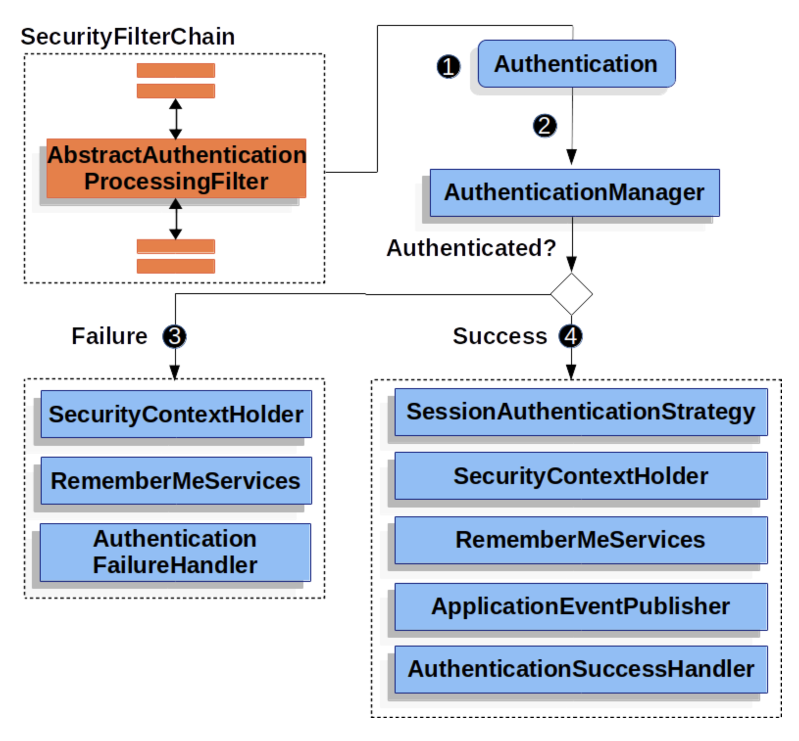

## AbstractAuthenticationProcessingFilter

- AbstractAuthenticationProcessingFilter는 사용자의 credential을 인증하기 위한 베이스 filter다.

- credential을 인증할 수 없다면, 스프링 시큐리티는 보통 AuthenticationEntryPoint로 credential을 요청한다

그러고 나면 AbstractAuthenticationProcessingFilter 는 제출한 모든 인증 요청을 처리할 수 있다.

(1) 사용자가 credential을 제출하면 AbstractAuthenticationProcessingFilter는 인증할 HttpServletRequest로부터 Authentication을 만든다. 생성하는 Authentication 타입은 AbstractAuthenticationProcessingFilter 하위 클래스에 따라 다른다.

- 예를 들어 UsernamePasswordAuthenticationFilter는 HttpServletRequest에 있는 username과 password로 UsernamePasswordAuthenticationToken을 생성한다.

(2)Authentication(위 예시에선 UsernamePasswordAuthenticationToken)을 AuthenticationManager로 넘겨서 인증한다

(3) 인증 실패하면, SecurityContextHolder 비우고 RememberMeServices.loginFail 실행. remember me 설정하지 않았다면 아무 동작도 하지 않는다. 그리고 AuthenticticationFailureHandler를 실행한다

(4) 인증 성공하면,

- SessionAuthenticationStrategy에 새로 로그인했음을 통보
- SecurityContextHolder에 Authentication을 세팅하고 이후 SecurityContextPersistenceFilter가 httpSession에 SecurityContext를 저장한다.
- RememberMeServices.loginSuccess를 실행한다. 설정 안했으면 아무 동작도 안 함.
- ApplicationEventPublisher는 InteractiveAuthenticationSuccessEvent 발생
