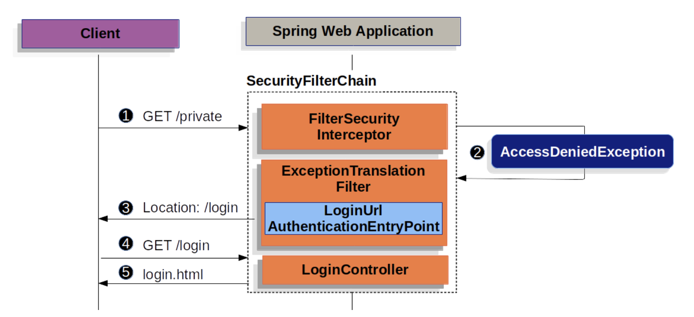
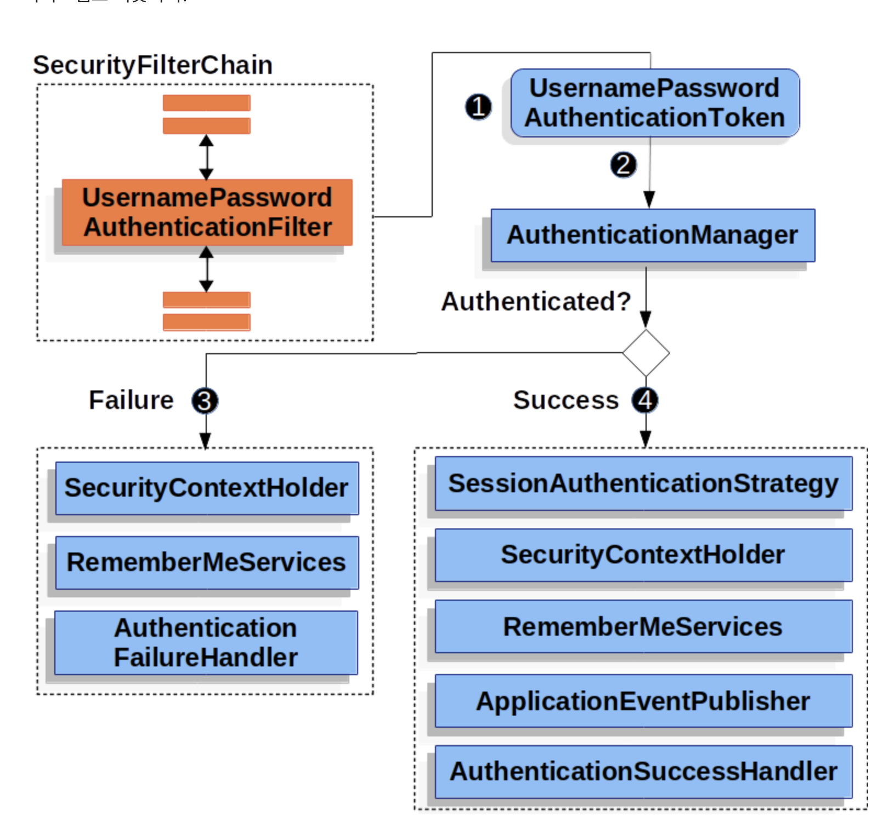

## 읽기 매커니즘, Form Login

- html 폼 기반 로그인 이름/비밀번호 인증 지원
  

(1) 권한 없는 리소스 /private에 인증되지 않은 요청  
(2) SecurityFilterChain의 FilterSecurityInterceptor에서 AccessDeniedException 예외 던짐  
이 말은 인증되지 않은 요청 거절했다는 말.

(3) 인증 안됨 -> ExceptionTranslationFilter에서 인증 시작,  
AuthenticationEntryPoint로 로그인 페이지로 리다이렉트 응답 전송

(10.8에 나왔떤 AuthenticationEntryPoint
인증되지 않은 사용자가 요청했을 때 작동)
(4) 로그인 페이지로 이동

-> username, password 제출하면 UsernamePasswordAuthenticationFilter 값 인증
UsernamePasswordAuthenticationFilter는 AbstractAuthenticationProcessingFilter 상속
(10.9.AbstractAuthenticationProcessingFilter는 사용자의 credential을 인증하기 위한 베이스 filter다.)



10.9에서 봤던 것과 비슷한 과정을 거침
(1) 사용자 username, password 제출하면 UsernamePasswordAuthenticatilFilter는 HttpServletRequest에서 값 추출해서
(Authentication유형 중 하나인)UsernamePasswordAuthenticationToken 생성

(2) UsernamePasswordAuthenticationToken을 AuthenticationManager에 넘겨 인증. 여기서 AuthenticationManager는 10.5앞에서 배웠듯이 리스트 돌아서 적절한 처리방법 찾아서 동작.

(3) 인증 실패(Failure)

- SecurityContextHolder 비움
- RemeberServices.loginFail 실행.
- AuthenticationFailureHandler 실행

(4) 성공

- SessionAuthenticationStrategy에 새로 로그인 했음을 통보
- RemeberMeServices.loginSuccess 실행
- ApplicationEventPublisher는 InteractiveAuthenticationSuccessEvent발생
- AuthenticationSuccessHandler 실행 보통 로그인 페이지로 리다이렉트할 때는
  SimpleUrlAuthenticationSuccessHandle가 ExceptionTranslationFilter에 저장된 요청으로 리다이렉트함

> Form login 설정

- 폼 로그인 디폴트 활성화
- 서블릿 기반으로 하면 설정해줘

```java
protected void configure(HttpSecurity http) {
    http
        // ...
        .formLogin(withDefaults());
}
```

- 로그인 페이지 설정

```java
protected void configure(HttpSecurity http) throws Exception {
    http
        // ...
        .formLogin(form -> form
            .loginPage("/login")
            .permitAll()
        );
}
```

- HTML 타임리프 로그인 폼

```html
<div th:if="${param.error}">Invalid username and password.</div>
<div th:if="${param.logout}">You have been logged out.</div>
<form th:action="@{/login}" method="post">
  <input type="text" name="username" placeholder="Username" />
  <input type="password" name="password" placeholder="Password" />
  <input type="submit" value="Log in" />
</form>
```

> 디폴트 HTML 폼 몇 가지 핵심 규칙

- /login에 post 요청 보내야함
- CSRF 토큰 포함, 타임리프에서는 자동추가
- 사용자이름 username, 비밀번호 passowrd 명시
- HTTP 파라미터 error 있으면 유효한 username/password 아니란 말
- HTTP 파라미터 logout있으면 로그아웃 한 것

```java
@Controller
class LoginController {
    @GetMapping("/login")
    String login() {
        return "login";
    }
}
```

Get /login 요청 직접 만들어서 더 세세하게 커스텀 가능하다
