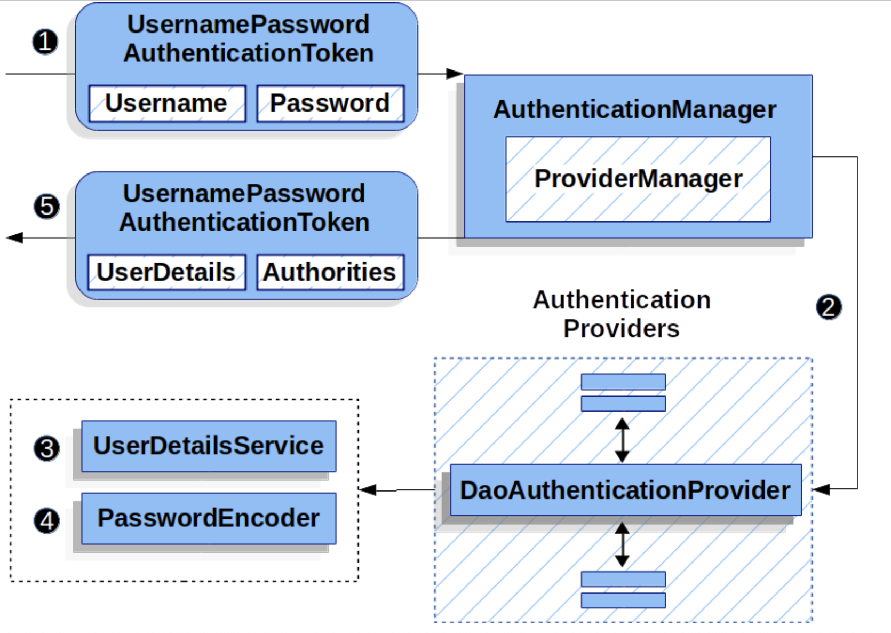

## DaoAuthenticationProvider

- DaoAuthenticationProvider는 AuthenticationProvider의 구현체이다
  

(1) username & password 조회하는 인증 filter에서 UsernamePasswordAuthenticationToken을
AuthenticationManager로 넘긴다. AuthenticationManager는 ProviderManager가 구현하고 있음
(2) ProviderManager는 DaoAuthenticationProvider를 AuthenticationProvider로 사용하도록 하고 있음
(3) DaoAuthenticationProvider는 UserDetails에 있는 비밀번호로 passwordEncoder 검증
(4) DaoAuthenticationProvider는 이전 단계에서 얻은 UserDetails에 있는 비밀번호를 PasswordEncoder로 검증

```java
    private void mitigateAgainstTimingAttack(UsernamePasswordAuthenticationToken authentication) {
        if (authentication.getCredentials() != null) {
            String presentedPassword = authentication.getCredentials().toString();
            this.passwordEncoder.matches(presentedPassword, this.userNotFoundEncodedPassword);
        }

    }
```
