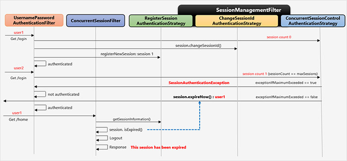

# SessionManagement

- SessionManagementFilter와 SessionAuthenticationStrategy 인터페이스가 HTTP 세션 관련 기능을 처리
- session-fixation 공격 방어, 세션 타임아웃 감지, 세션 수 제한 등에 사용

> 10.11.1 Detecting Timeouts

- 유효하지 않은 세션 ID 제출? 감지해서 적절한 URL로 리다이렉트

```java
    @Override
    protected void configure(HttpSecurity http) throws Exception {
        http.sessionManagement()
                .invalidSessionUrl("/invalidSession.htm");
    }
```

- 이렇게 하면 로그아웃하고 바로 로그인 시도하면 꼬일 수 있다. JESSION 쿠기 남아있기 때문에
- 로그아웃 할 때 쿠키 삭제해줘라.

```java
  http.
    .deleteCookies("JSESSIONID"); // 쿠키 날리기
```

- 어플리케이션 앞단에 프록시가 있다면 프록시 서버 설정으로도 삭제할 수 있음

> 10.11.2 Concurrent Session Control

- 같은 사용자 여러 번 로그인 할 수 없도록 제한할 수 있음

```java
        http.sessionManagement()
                .maximumSessions(3) //3개 까지 로그인
                .maxSessionsPreventsLogin(false); //false-중복 로그인 시 이전 로그인 풀림 (default)
                .maxSessionPreventsLogin(true); // 새로운 로그인 안 됨
                //error-if-maximum-exceeded="true"
//첫번 째 사용자가 로그인 하고 두번 째 사용자 로그인 시도 시 두번 째 사용자는 로그인 실패
                .expriedUrl()  // 세션만료시 이동 페이지 invalidSessionUrl 설정시 그게 우선임
```

> 10.11.3 Session Fixation Attack Protection

- 사이트 접근해서 세션 생성 -> 다른 사용자가 이 세션으로 로그인 하도록 유도
- session-fixation?  
  attacker가 사이트 접속, session 생성 후, 자신의 session id를 user에게 전달  
  user로 하여금 동일 session id를 사용하여 사이트에 로그인하게 함  
  user가 로그인에 성공하면 user와 attacker는 동일한 session을 공유함  
  attacker는 이 상태에서 user로 가장, 악의적 행위를 함

### 방어 방법

- none : 아무것도 하지 않음
- newSession : 깨끗한 새 세션 만들고 기존 세션 데이터는 복사해가지 않는다.(로그인 시 새 세션 만들어 줌)
- migrateSession : 새 세션 만들고 기존 세션 속성 모두 새 세션에 복사(서블릿3.0이전, 이전 컨테이너)
- changeSessionId : sessionId 바꿈(서블릿3.1 이후 컨테이너 디폴트 사용)

```java
  http.sessionManageMent()
      .sessionFixation().changeSessionId() // 기본값 - 인증성공하면 세션아이디만 변경시킨다.
```

> 10.11.4 SessionManagementFilter

- SessionManagementFilter는 SecurityContextRepository 컨텐츠를 SecurityContextHolder에 있는 현재 컨텐츠와 비교해서 현재 요청을 처리하는 동안 사용자를 인증했는지 확인한다
- 추가, Authentication 객체는 필터 체인 상의 최초에 위치한 SecurityContextPersistenceFilter의 (repo)session에 저장된다. 그리고 다음 접속 시에는 (repo)session에서 정보가 담긴 Authentication 객체를 가져올 수 있게 된다. ( Load/Save 처리 )

- pre-authentication, remember-me 같은 상호작용 없는 인증에 사용
- SecurityContextRepository에 인증 컨텍스트 있으면 그냥 pass
- 인증 context 없어? 스레드 로컬 SecurityContext에 Authentication 객체 있어? 인증한 것 SessionAuthenticationStrategy 실행
- 유효하지 않으면 InvalidSessionStrategy 실행

  

- user 1

1. UsernamePasswordAuthenticationFilter : 최초 유저 로그인
2. ConcurrentSessionControlAuthStrategy 클래스 호출 : 사용자 세션 0개네! ok
3. ChangeSessionIdAuthStrategy 클래스 호출 : changeSessionId()? 세션 쿠키 발급
4. RegisterSessionAuthStrategy 클래스 호출 : 세션 등록

- 로그인 되어 있는 user 2

1. ConcurrentSessionControlAuthStrategy 클래스 호출 : 아까 왔던애다.
2. 인증 성공 : user1 세션 만료 (exceptionMaixmumExceeded == false)

- 인증 실패 : 아까 왔잖아 (exceptionMaixmumExceeded == true)

3. ChangeSessionIdAuthStrategy 클래스 호출 : 세션 쿠키 발급
4. RegisterSessionAuthStrategy 클래스 호출 : 세션 등록

- user1 재 방문 시 ConcurrentSessionFilter 세션 만료. 로그아웃

> 10.11.5 SessionAuthenticationStrategy

- SessionAuthenticationStrategy는 SessionManagementFilter와 AbstractAuthenticationProcessingFilter 둘 다 사용.

- 인증 context 없어? 스레드 로컬 SecurityContext에 Authentication 객체 있어? 인증한 것 SessionAuthenticationStrategy 실행
  (세션 정책을 수행한다 정도로 이해하면 될 것 같다
  Composite 이라는 말이 합쳐놓은 것이니 여러가지 정책들을 수행합니다.)

> 10.11.6 Concurrency Control

- 같은 어플리케이션에 동시 인증 횟수 제한 가능
- 동시성제어는 SessionAuthenticationStrategy를 구현한 ConcurrentSessionControlAuthenticationStrategy가 담당

```java
public void onAuthentication(Authentication authentication, HttpServletRequest request, HttpServletResponse response) {
  int allowedSessions = this.getMaximumSessionsForThisUser(authentication);
  if (allowedSessions != -1) {
    List<SessionInformation> sessions = this.sessionRegistry.getAllSessions(authentication.getPrincipal(), false);
    int sessionCount = sessions.size();

    // ✨세션 Count가 초과 되었다면?
    if (sessionCount >= allowedSessions) {

      // ✨ 하지만 맥시멈과 동일하고, 요청 세션 == 세션들 중 하나 → PASS
      if (sessionCount == allowedSessions) {
        HttpSession session = request.getSession(false);
        if (session != null) {
          Iterator var8 = sessions.iterator();

          while(var8.hasNext()) {
            SessionInformation si = (SessionInformation)var8.next();
            if (si.getSessionId().equals(session.getId())) {
              return;
            }
          }
        }
      }

      // ✨ 자 만료를 시키러 가봅시다!
      this.allowableSessionsExceeded(sessions, allowedSessions, this.sessionRegistry);
    }
  }
}

// ✨ 초과된 세션 만료 시키기!
protected void allowableSessionsExceeded(List<SessionInformation> sessions, int allowableSessions, SessionRegistry registry) throws SessionAuthenticationException {
  if (!this.exceptionIfMaximumExceeded && sessions != null) {
    // ✨ 초과된 세션들을 가져오기 위해서 마지막에 요청된 녀석들을 먼저 나오도록 정렬한다!
    sessions.sort(Comparator.comparing(SessionInformation::getLastRequest));
    int maximumSessionsExceededBy = sessions.size() - allowableSessions + 1;
    List<SessionInformation> sessionsToBeExpired = sessions.subList(0, maximumSessionsExceededBy);
    Iterator var6 = sessionsToBeExpired.iterator();

    while(var6.hasNext()) {
      SessionInformation session = (SessionInformation)var6.next();
      session.expireNow(); // ✨ 만료 가즈아!
    }

  } else {
    throw new SessionAuthenticationException(this.messages.getMessage("ConcurrentSessionControlAuthenticationStrategy.exceededAllowed", new Object[]{allowableSessions}, "Maximum sessions of {0} for this principal exceeded"));
  }
}
```
