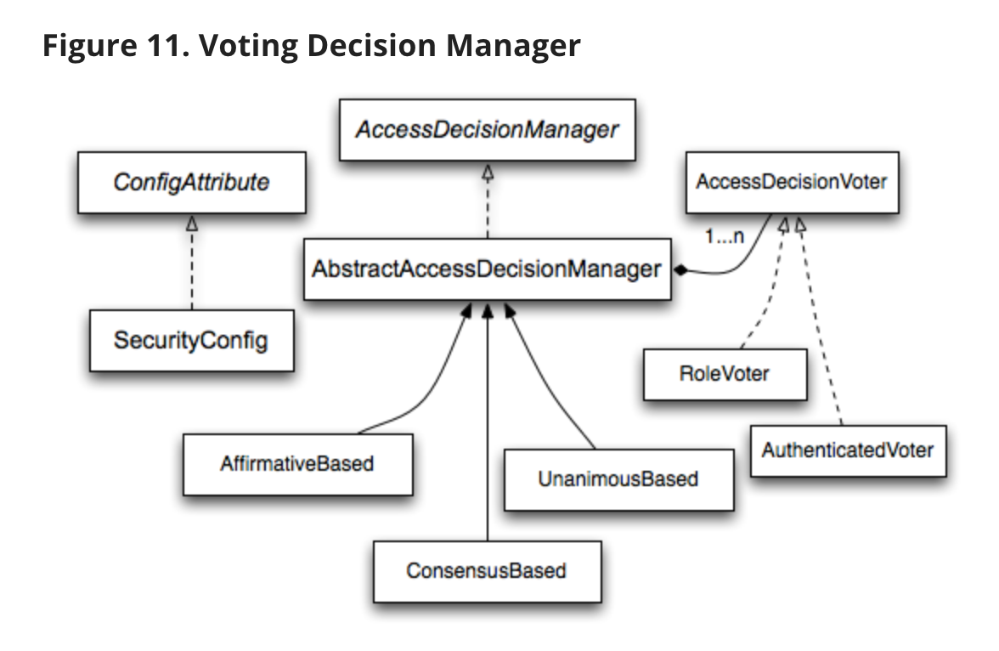
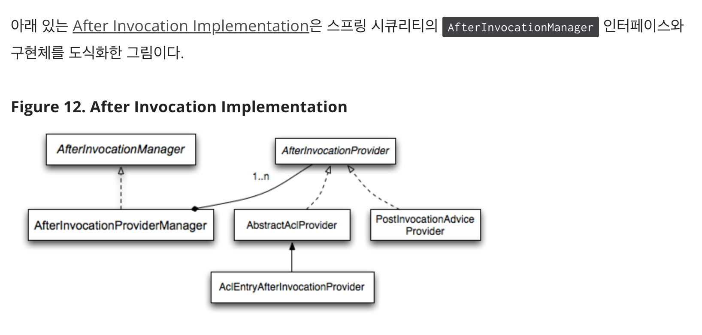

# Authorization Architecture

### 11.1.1 Authorities

- Authentication 섹션에선 모든 Authentication 구현체가 GrantedAuthority 객체 리스트를 저장하는지를 설명한다. GrantedAuthority 객체는 principal에 부여한 권한을 나타낸다. AuthenticationManager가 GrantedAuthority 객체를 Authentication 객체에 삽입하여 이후 권한 결정할 때 AccessDecisionManager가 GrantedAuthority를 읽는다
- AccessDecisionManager에선 getAuthrity(); 메소드로 GrantedAuthority를 string으로 조회
- String으로 명확하게 표현 못하면 "복잡한 케이스"로 간주 null 리턴 (고객 계정 번호에 따라 적용할 작업과 권한 임게치 리스트 저장... => role이 아니라 회원마다 권한 주면 null 준다는 뜻인 것 같아)
- null 리턴했다? AccessDeicisionManager에 GratnedAuthority를 이해하기 위한 구체적인 코드가 있어야 한다는 뜻

- 스프링 시큐리티는 GrantedAuthority 구현체인 SimpleGrantedAuthority를 제공. 이 클래스는 사용자가 지정한 String을 GrantedAuthority로 변환해준다.

### 11.1.2. Pre-Invocation(사전호출) Handling

- 스프링 시큐리티는 보안 객체에 대한 접근 제어하는 인터셉터 제공한다
- 호출 허용할지 말지 결정하는 pre-invocation은 AccessDecisionManager에서 결정

> The AccessDecisionManager

- AccessDecisionManager 는 AbstractSecurityInterceptor에서 호출, 최종적인 접근 제어 결정

```java
void decide(Authentication authentication, Object secureObject,
    Collection<ConfigAttribute> attrs) throws AccessDeniedException;

boolean supports(ConfigAttribute attribute);

boolean supports(Class clazz);
```

- AccessDeicisionManager의 decide 메소드는 권한 결정하기 위한 모든 정보를 건내 받는다
- 보안 Object 받으면 실제 보안 객체를 실행할 때 넘긴 인자를 검사할 수 있다
- 예를 들어 보안 객체가 MethodInvocation이었다고 가정해보자. MethodInvocation으로 모든 Customer 인자를 쉽게 찾을 수 있으며 AccessDecisionManager 안에서 일련의 보안 로직으로 principal이 customer 관련 동작을 실행하도록 허가할 수 있다. 접근 거절하면 AccessDeniedException 던진다

- supports 메소드는 기동 시점에 AbstractSecurityInterceptor가 호출하며, AccessDecisionManager가 건내받은 ConfigAttribute의 처리 가능 여부 결정( 제출한 보안 객체 타입을 지원하는지 확인)

> Voting-Based AccessDecisionManager Implementations

- 인가 관련 동작 제어하고 싶으면 AccessDecisionManager 커스텀해서 사용해도 되지만, 스프링 시큐리티는 투표 기반으로 동작하는 몇 가지 AccessDecisionManage 구현체를 제공한다

  

- 투표 방식에선 권한을 결정할 때 일련의 AccessDecisionVoter 구현체에 의견을 묻는다. 그리고 AccessDecisionManager 가 투표 결과 취합해서 AccessDeniedException을 던질지 말지 결정한다

- AccessDecisionVoter는 메소드 세 개를 가진 인터페이스다

```java
int vote(Authentication authentication, Object object, Collection<ConfigAttribute> attrs);

boolean supports(ConfigAttribute attribute);

boolean supports(Class clazz);
```

- 구현체는 AccessDecisionVoter의 스태틱 필드 ACCESS_ABSTAIN, ACCESS_DENIED, ACCESS_GRANTED 중 하나를 의미하는 int 값을 리턴한다
- 특별한 의견 없음(기권! abstain)
- 의견 있다면 denied, granted
- 스프링 시큐리티는 투표 결과를 집계하는 세 가지 AccessDecisionManager 구현체 제공.
- 1. ConsensusBased는 기권표 제외하고 투표 결과 합산해서 접근 허가하거나 거절한다. 투표 결과가 동점이거나 모두 기권표일 때의 동작은 프로퍼티로 조절할 수 있다.
- 2.  AffirmativeBased는 GRANTED가 하나라도 있으면 권한 부여(i.e. 찬성표가 하나라도 있으면 거절표는 무시)
- ConsensusBased와 마찬가지로 모두 기권했을 때의 동작을 제어할 수 있는 파라미터 제공.
- 3. UnanimouBased는 기권을 제외한 모든 표가 만장일치로 GRANTED일 때만 접근 허용. Denied가 하나라도 있으면 접근 거부.
- 다른 구현체와 마찬가지로 모두 기권했을 때의 동작 제어하는 파라미터 있음

- 커스텀 물론 가능. 예를 들어 특정 AccessDecisionVoter의 투표에는 가중치를 두고, 특정 voter의 거절표는 기각시킬 수 있다.

> RoleVoter

- AccessDecisionVoter 중 가장 많이 사용하는 건 간단한 RoleVoter다.
- ROLE\_로 시작하는 ConfigAttribute이 있을 때 투표에 참여
- ROLE*로 시작하는 ConfigAttributes 중 하나라도 완전 일치하면 찬성표 던짐. 일치하는 게 없으면 반대표. ROLE*로 시작하는 ConfigAttribute가 없으면 기권

> AuthenticatedVoter

- AuthenticatedVoter는 익명 사용자와, 완전 인증 사용자와 remember-me로 인증한 사용자를 구분할 수 있다.
- 익명사용자 접근을 위한 IS_AUTHENTICATED_ANONYMOUSLY 속성은 AuthenticatedVoter가 처리한다.

> 커스텀 votingDecisionManager
> 커스텀도 할 수 있음. 실시간으로 정지된 계정의 접근 거절 할 수 있다

### 11.1.3. After Invocation Handling

- 보안 객체를 실행하기 전에는 AbstractSecurityInterceptor가 AccessDecisionManager를 호추랗는데 반면 실제로 보안 객체가 리턴하는 객체를 바꿔야 하는 어플리케이션도 있다
- 편리한 훅 제공
  

- AfterInvociationManger도 AfterInvocationProviderManager라는 구현체가 하나 있고 AfterInvociationProvider 리스트를 폴링한다. 각 AfterInvocationProvider는 리턴 객체를 수정하거나 AccessDeniedException 던저 수 있음
- AfterInvocationManager 사용해도 MethodSecurityInterceptor의 AccessDecisionManager가 동작 허용하려면 설정 소것ㅇ이 필요하다. 전형적인 설정 사용하면 특정 method invocation 보호 위해 정의한 설정 속성 없는 경우 모든 AccessDecisionVoter가 투표 기권할 거다. 그래서 접근 허용에 투표할만한 설정 속성 최소 한 개 사용 보통 ROLE_USER나 ROLE_AUTHENTICATED 설정 속성 이용

### 11.1.4. Hierarchical Roles

- 어떤 role은 자동으로 다른 role도 "포함"해야한다.
- admin은 user가 할 수 있는 모든 일을 할 수 있어야한다
- 모든 admin에게 user role 부여할 수도 있겠지만 많아지면 귀찮고 복잡해짐
- role-hierarchy 사용

```xml
<bean id="roleVoter" class="org.springframework.security.access.vote.RoleHierarchyVoter">
    <constructor-arg ref="roleHierarchy" />
</bean>
<bean id="roleHierarchy"
        class="org.springframework.security.access.hierarchicalroles.RoleHierarchyImpl">
    <property name="hierarchy">
        <value>
            ROLE_ADMIN > ROLE_STAFF
            ROLE_STAFF > ROLE_USER
            ROLE_USER > ROLE_GUEST
        </value>
    </property>
</bean>
```

- RoleHierarchyvoter는 RoleHierarchy를 설정할 수 있다
- ROLE_ADMIN > ROLE_STAFF > ROLE_USER > ROLE_GUEST

```java
@bean
public RoleHierarchyImpl roleHierarchy(){
    RoleHierarchyImpl roleHierarchy = new RoleHierarchyImpl();
    roleHierarchy.setHierarchy("ROLE_ADMIN > ROLE_MANAGER > ROLE_USER");
    return roleHierarchy
}

@bean
public AccessDecisionVoter<? extends Object> roleVoter(){
    RoleHierarchyVoter roleHierarchyVoter = new RoleHierarchyVoter(roleHierarchy());
    return roleHierarchyVoter;
}
```
