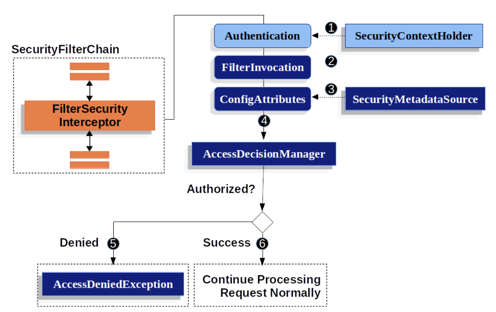

# 11.2. Authorize HttpServletRequest with FilterSecurityInterceptor

- 서블릿 기반 어플리케이션에서 권한 부여 하는 방법을 자세히 알아본다
- FilterSecurityInterceptor는 HttpServletRequest를 사용해서 권한인가해준다.  
  이 인터셉터는 FilterChainProxy의 보안 필터이다.



1. FilterChainInterceptor가 SecurityContextHolder에서 Authentication 조회
2. 넘겨받은 HttpServletRequest, HttpServletResponse, Interceptor를 활용해서 FilterChainInterceptor가 FilterInvocation을 만든다
3. FilterInvocation을 SecurityMetadataSource로 넘겨 ConfigAttribute 컬렉션을 가져온다.
   (✔ ConfigAttribute
   권한 통과 조건은 경로에 따라 혹은 접근하고자 하는 메서드에 따라 달라져야 합니다. 이 때, 각각의 경로, 메서드가 가진 통과 조건을 담는을 수 있는 객체가 ConfigAttribute입니다.)
4. Authentication, FilterInvocation, ConfigAttribute 컬렉션을 AccessDecisionManager로 넘긴다

```java
void decide(Authentication authentication, Object secureObject,
    Collection<ConfigAttribute> attrs) throws AccessDeniedException;
```

- AccessDeicisionManager의 decide 메소드는 권한 결정하기 위한 모든 정보를 건내 받는다

5. (거절) AccessDeniedException
6. (승인) FilterChain 이어감

---

- 기본적으로 스프링 시큐리티에서 권한 인가하려면 모든 요청을 인증해야 한다

```java
protected void configure(HttpSecurity http) throws Exception {
    http
        // ...
        .authorizeRequests(authorize -> authorize
            .anyRequest().authenticated()
        );
}
```

```java
protected void configure(HttpSecurity http) throws Exception {
    http
        // ...
        .authorizeRequests(authorize -> authorize // (1) 인가 조건 여러 개 지정, 선언 순서대로 적용
            .mvcMatchers("/resources/**", "/signup", "/about").permitAll() // (2) 해당 요청 모두 접근 가능
            .mvcMatchers("/admin/**").hasRole("ADMIN") // (3) ADMIN 사용자 접근
            .mvcMatchers("/db/**").access("hasRole('ADMIN') and hasRole('DBA')") // (4) ADMIN과 DBA 조건 둘다 필요
            .anyRequest().denyAll() // (5) 위 조건을 충족하지 않는 경우 접근 거절, 인증 조건 누락 실수 방지 위해 사용 추천
        );
}
```

# 11.3. Expression-Based Access Control

- 스프링 시큐리티 3.0부터 스프링 EL 표현식 사용해 인가 메커니즘 구현할 수 있다.

- 표현식을 평가할 땐 평가 컨텍스트의 일부로 루트 객체(기본 프로토타입으로 설정)를 사용
- 별도의 내장 표현식을 사용 가능, 현재 principal 등에 접근할 수 있음

> ### 스프링 EL 표현식

- hasRole(Stirng role)
  - 현재 보안 주체(principal)가 지정된 역할을 갖고 있는지 여부를 확인하고 가지고 있다면 true를 리턴한다.
  - hasRole(’admin’)처럼 파라미터로 넘긴 role이 ROLE\_ 로 시작하지 않으면 기본적으로 추가
  - DefaultWebSecurityExpressionHandler의 defaultRolePrefix를 수정하면 커스텀 가능
- hasAnyRole(String… roles)
  - 현재 보안 주체가 지정한 역할 중 1개라도 가지고 있으면 true를 리턴
  - 문자열 리스트를 콤마로 구분해서 전달
    ex) hasAnyRole(’admin’, ‘user’)
- hasAuthority(String authority)
  - 현재 보안 주체가 지정한 권한을 갖고 있는지 여부를 확인하고 가지고 있다면 true를 리턴
    ex) hasAuthority(’read’)
- hasAnyAuthority(String… authorities)
  - 현재 보안 주체가 지정한 권한 중 하나라도 있으면 true를 리턴한다.
    ex) hasAnyAuthority(’read’, ‘write’)
- principal
  - 현재 사용자를 나타내는 principal 객체에 직접 접근 가능
- authentication
  - SecurityContext로 조회할 수 있는 현재 Authentication 객체에 직접 접근 가능
- permitAll
  - 항상 true
- denyAll
  - 항상 false
- isAnonymous()
  - 현재 보안 주체가 익명 사용자면 true
- isRememberMe()
  - 현재 보안 주체가 remember-me 사용자면 true
- isAuthenticated()
  - 사용자가 익명이 아닌 경우 true
- isFullyAuthenticated()
  - 사용자가 익명 사용자나 remember-me 사용자가 아니면 true
- hasPermission(Object target, Object permission)

  - hasPermission(Object targetId, String targetType, Object permission) 사용자가 target에 해당 permission 권한이 있으면 true
    ex) hasPermission(domainObject, ‘read’)
    ex) hasPermission(1, ‘com.example.domain.Message’, ‘read’)

- 표현식 쓸거면 <http>요소의 ues-expression속성 true로

```xml
<http>
    <intercept-url pattern="/admin*"
        access="hasRole('admin') and hasIpAddress('192.168.1.0/24')"/>
    ...
</http>
```

- admin, local subnet 접근만 허용

> 시큐리티 표현식 추가하기

- 스프링 빈으로 정의하여 쉽게 참조 가능

```java
public class WebSecurity {
        public boolean check(Authentication authentication, HttpServletRequest request) {
                ...
        }
}
```

```xml
<http>
    <intercept-url pattern="/user/**"
        access="@webSecurity.check(authentication,request)"/>
    ...
</http>
```

```java
http
    .authorizeRequests(authorize -> authorize
        .antMatchers("/user/**").access("@webSecurity.check(authentication,request)")
        ...
    )
```

> Path variable 표현식에 활용하기

- URL에 있는 path variable 참조해야할 경우 /user/{userId}

WebSecurity이름의 빈에 생성

```java
public class WebSecurity {
        public boolean checkUserId(Authentication authentication, int id) {
                ...
        }
}
```

그리고 이렇게 사용

```java
http
    .authorizeRequests(authorize -> authorize
        .antMatchers("/user/{userId}/**").access("@webSecurity.checkUserId(authentication,#userId)")
        ...
    );
```

> ### 어노테이션

- 사전, 사후 권한 체크
- @Pre, @Post
- @PreAuthorize, @PreFilter, @PostAuthorize, @PostFilter

```xml
<global-method-security pre-post-annotations="enabled"/>

```

> @PreAuthorize

```java
@PreAuthorize("hasRole('USER')")
public void create(Contact contact);
```

- ROLE_USER 접근 가능

```java
@PreAuthorize("hasPermission(#contact, 'admin')")
public void deletePermission(Contact contact, Sid recipient, Permission permission);
```

- 내장표현식 hasPermission()
  - hasPermission(Object target, Object permission)
  - 사용자가 주어진 권한에 대해 제공된 대상에 액세스 할 수 있는지 여부를 반환합니다. 예를 들면 hasPermission(domainObject, 'read')
  - 스프링 시큐리티 ACL 모듈과 연결되어 있어서 빌트인 표현식 사용 가능 hasPermission()같은 거
- 인자로 들어온 contact 정보를 활용해서 권한 체크

```java
import org.springframework.security.access.method.P;

@PreAuthorize("#c.name == authentication.name")
public void doSomething(@P("c") Contact contact);
```

- @P(시큐리티), @Param(스프링) 어노테이션 활용하면 커스텀한 이름 사용해서 @PreAuthorize 표현식 작성 가능

```java
import org.springframework.data.repository.query.Param;

@PreAuthorize("#n == authentication.name")
Contact findContactByName(@Param("n") String name);
```

- 바로 위 내용과 마찬가지 @Param으로 받은 거 #n으로 바로 사용가능

- 이걸 응용해서 username이 연락처 이름과 일치하는 사람만 권한 허가해주고 싶으면 이렇게 쓸 수 있음

```java
@PreAuthorize("#contact.name == authentication.name")
public void doSomething(Contact contact);
```

> @PostAuthorize

- 일반적이진 않지만 메소드 실행후에 접근 제어하고 싶다면?
- @PostAuthorize 사용하면 된다

> @PostFilter, @PreFilter

- 스프링 시큐리티는 컬렉션이나 배열 필터링 제공해주는데 표현식으로 구현 가능해짐

- @PostFilter 쓰면 리턴된 컬렉션 순회해서 표현식 결과가 false인 모든 요소 제거한다.

```java
      @Override
      @PreAuthorize("hasAuthority('USER')")
      @PostFilter("hasAnyAuthority('ADMIN') or filterObject.owner == authentication.name")
      public List<Todo> listTodos() {
          return todoRepository.findAll();
      }
```

- 쉽게 말해 앞선 두 어노테이션은 보안 규칙에 맞지 않을 경우 error를 던지지만 @PreFilter/@PostFilter는 단순히 접근 권한을 체크하는 것
- 전체 데이터는 ADMIN만 볼 수 있고, USER는 본인의 todo만 열람가능하도록 제한을 둘 수 있다.

- @PreFilter, @PostFilter는 매서드 입출력을 필터링하는 편리한 수단이다.
- 결과가 대용량일 경우 성능저하;
- 필터링은 데이터 조회 쿼리를 튜닝하는 용도가 아니라는 점 명심.

> ACL? (Access Control List)

- Spring Security는 자체로 ACL(Access Control List, 접근 통제 목록)을 설정하는 전용 모듈을 지원

- 내장표현식 hasPermission() 쓸 수 있는 이유?
  - 스프링 시큐리티 ACL 모듈과 연결되어 있어서 빌트인 표현식 사용 가능 hasPermission()같은 거
- 이 표현식(들)은 PermissionEvaluator 인스턴스로 위임된다.
- PermissionEvaluator는 스프링 시큐리티의 ACL 시스템을 연결라기 위한 것
- 추상적인 permission 기반으로 도메인 객체에 인가 조건 지정 가능
- 필요하다면 ACL 모듈 말고 다른 구현체로 바꿔서 쓸 수도 있음(어떤 ???가 만들어서 뿌린 모듈 존재할 듯)

- 인터페이스에 두 개 메서드 존대

```java
boolean hasPermission(Authentication authentication, Object targetDomainObject,
                            Object permission);

boolean hasPermission(Authentication authentication, Serializable targetId,
                            String targetType, Object permission);
```

- 제공하고 있는 모든 표현식 매핑(Authentication 객체는 줘야함, 없으면 의미가 없어서 매핑안됨)
- 첫번 째 메서드는 접근 제어하는 도메인 객체를 이미 로드한 경우
- 두번 째는 로드 안 했는데 식별자 알 때 사용

- 물론 이 표현식들도 사용하려면 설정해줘야함

> 메타 어노테이션

- 코드 반복 줄이기 위해 메타 어노테이션 만들 수 있음

```java
@PreAuthorize("#contact.name == authentication.name")
//========>>>
@Retention(RetentionPolicy.RUNTIME)
@PreAuthorize("#contact.name == authentication.name")
public @interface ContactPermission {}
```

# 11.4. Secure Object Implementations

> AOP Alliance(MethodInvocation) Security Interceptor

- 스프링 시큐리티 2.0 이전엔 MethodInvocation을 보호하려면 꽤 많은 설정이 필요
- 권장하는 메소드 시큐리티 설정 방법은 네임스페이스 설정 -> 빈들이 자동으로 설정, 구현체를 알 필요 없음

- 메소드 시큐리티는 MethodInvocation을 보호해주는 MethodSecurityInterceptor로 구현
- 인터셉터는 MethodSecurityMetadataSource 인스턴스를 사용해서 특정 method invocation에 적용할 설정 속성을 가져옴
- MapBasedMethodSecurityMetadataSource로는 메소드 이름을 (와일드카드 지원) 키로 갖는 설정 속성을 저장, 내부적으로 <intercept-methods>나 <protect-point> 요소로 어플리케이션에 해당 속성을 정의했을 때 사용한다 ???

# Explicit MethodSecurityInterceptor Configuration

- 어플리케이션 컨텍스트에 MethodSecurityInterceptor 직접 설정해서 스프링 AOP의 프록시 메커니즘과 함께 사용이 가능하다

```
<bean id="bankManagerSecurity" class=
    "org.springframework.security.access.intercept.aopalliance.MethodSecurityInterceptor">
<property name="authenticationManager" ref="authenticationManager"/>
<property name="accessDecisionManager" ref="accessDecisionManager"/>
<property name="afterInvocationManager" ref="afterInvocationManager"/>
<property name="securityMetadataSource">
    <sec:method-security-metadata-source>
    <sec:protect method="com.mycompany.BankManager.delete*" access="ROLE_SUPERVISOR"/>
    <sec:protect method="com.mycompany.BankManager.getBalance" access="ROLE_TELLER,ROLE_SUPERVISOR"/>
    </sec:method-security-metadata-source>
</property>
</bean>
```

> AspectJ (JoinPoint) Security Interceptor
> : AspectJ는 PARC에서 개발한 자바 프로그래밍 언어용 관점 지향 프로그래밍 (AOP) 확장 기능이다.

... 오... AspectJ는 따로 공부해야되는...???

- AspectJ 보안 인터셉터는 앞에서 설명한 AOP Alliance 보안 인터셉터와 매우 유사
  (관점을 비슷하게 가져가서 구조가 비슷하다는 걸까?)

- AspectJ 인터셉터 이름 - AspectJSecurityInterceptor
- AspectJSecurityInterceptor는 AspectJ 컴파일러를 통해 구성됨
  <-> AOP Alliance, 프록시를 통해 인터셉터를 구성할 때 스프링 어플리케이션 컨텍스트에 의존(AspectJ와 다름)
- 어플리케이션 하나에 보안 인터셉터 두 종류를 모두 사용하기도 함.
- 보통 AspectJSecurityInterceptor로 도메인 객체 인스턴스 보안을 처리,  
  AOP Alliance MethodSecurityInterceptor로 서비스 레이어 보안을 처리

-> 스프링 어플리케이션 컨텍스트에 AspectJSecurityInterceptor를 설정하는 방법

```xml
<bean id="bankManagerSecurity" class=
    "org.springframework.security.access.intercept.aspectj.AspectJMethodSecurityInterceptor">
<property name="authenticationManager" ref="authenticationManager"/>
<property name="accessDecisionManager" ref="accessDecisionManager"/>
<property name="afterInvocationManager" ref="afterInvocationManager"/>
<property name="securityMetadataSource">
    <sec:method-security-metadata-source>
    <sec:protect method="com.mycompany.BankManager.delete*" access="ROLE_SUPERVISOR"/>
    <sec:protect method="com.mycompany.BankManager.getBalance" access="ROLE_TELLER,ROLE_SUPERVISOR"/>
    </sec:method-security-metadata-source>
</property>
</bean>
```

- 클래스 명 제외, AspectJSecurityInterceptor는 AOP Alliance 보안 인터셉터와 완전히 동일
- SecurityMetadataSource는 AOP 라이브러리에 있는 클래스가 아닌 java.lang.reflect.Method로 동작하기 때문에 두 인터셉터에 같은 securityMetadataSource를 공유하는 것도 가능
- 접근 권한을 결정할 땐 관련 AOP 라이브러리 전용 invocation을 (i.e. MethodInvocation 또는 JoinPoint) 사용하기 때문에 다양한 추가 기준을 고려해서 결정할 수 있다 (메소드 인자 등)

- AspectJ aspect 정의

```
package org.springframework.security.samples.aspectj;

import org.springframework.security.access.intercept.aspectj.AspectJSecurityInterceptor;
import org.springframework.security.access.intercept.aspectj.AspectJCallback;
import org.springframework.beans.factory.InitializingBean;

public aspect DomainObjectInstanceSecurityAspect implements InitializingBean {

    private AspectJSecurityInterceptor securityInterceptor;

    pointcut domainObjectInstanceExecution(): target(PersistableEntity)
        && execution(public * *(..)) && !within(DomainObjectInstanceSecurityAspect);

    Object around(): domainObjectInstanceExecution() {
        if (this.securityInterceptor == null) {
            return proceed();
        }

        AspectJCallback callback = new AspectJCallback() {
            public Object proceedWithObject() {
                return proceed();
            }
        };

        return this.securityInterceptor.invoke(thisJoinPoint, callback);
    }

    public AspectJSecurityInterceptor getSecurityInterceptor() {
        return securityInterceptor;
    }

    public void setSecurityInterceptor(AspectJSecurityInterceptor securityInterceptor) {
        this.securityInterceptor = securityInterceptor;
    }

    public void afterPropertiesSet() throws Exception {
        if (this.securityInterceptor == null)
            throw new IllegalArgumentException("securityInterceptor required");
        }
    }
}
```

- 보안 인터셉터는 모든 PersistableEntity 인스턴스에 적용되며 PersistableEntity는 추상클래스 (원하는 다른 클래스나 pointcut 표현식을 사용해도 됨)
- AspectJCallback은 proceed(); 구문은 around() 본문 내에 있을 때만 특별한 의미를 가짐
- AspectJSecurityInterceptor는 타겟 객체를 계속 이어가려면 이 익명 AspectJCallback 클래스를 실행한다

- 스프링이 aspect를 로드하고 AspectJSecurityInterceptor와 연결할 수 있도록 설정해줘야한다.. 이렇게 설정할 수 있음

```xml
<bean id="domainObjectInstanceSecurityAspect"
    class="security.samples.aspectj.DomainObjectInstanceSecurityAspect"
    factory-method="aspectOf">
<property name="securityInterceptor" ref="bankManagerSecurity"/>
</bean>
```

- 이게 전부다!(ㅋㅋㅋ)
- 이제 어플리케이션 내 어디든지 적합하다고 생각하는 방법으로 빈을 만들 수 있으며, 그 빈에는 시큐리티 인터셉터가 적용될 거다.
